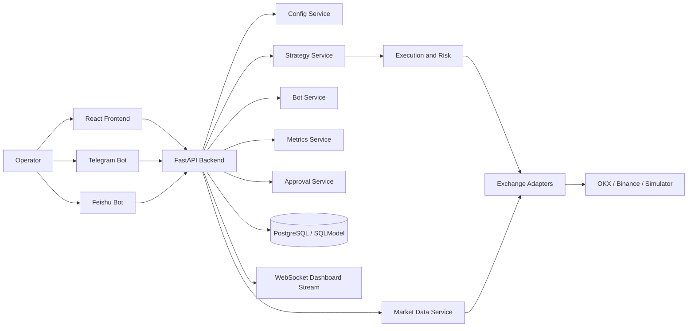
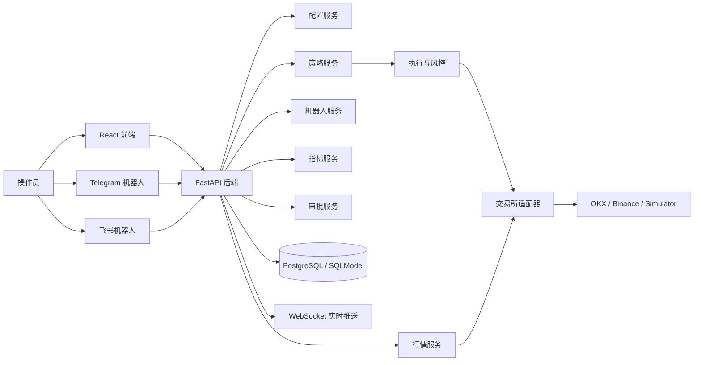

# Multi-Symbol AI Quant Trading Platform

[](https://github.com/kuqitt/multi-symbol-ai-quant-platform/actions/workflows/pytest.yml)
[](https://github.com/kuqitt/multi-symbol-ai-quant-platform/releases)
[](https://github.com/kuqitt/multi-symbol-ai-quant-platform/blob/main/LICENSE)
[](https://github.com/kuqitt/multi-symbol-ai-quant-platform/issues)

English | [简体中文](#简体中文)

An open-source, safety-first AI / quant trading platform for multi-symbol research, paper trading, testnet execution, monitoring, approvals, and bot-based operations.

This project combines a FastAPI backend, a React + Vite frontend, exchange adapters, portfolio and risk controls, research workflows, and Telegram / Feishu bot control into one extensible workspace.

| Focus | What you get |
| --- | --- |
| Safety-first runtime | Paper-first defaults, live-trading guardrails, approvals, protect mode |
| Operator tooling | Dashboard, replay, logs, metrics, Telegram bot, Feishu bot |
| Research workflow | Backtest APIs, optimization foundation, walk-forward structure |
| Open collaboration | MIT license, bilingual docs, issue templates, PR template, CI |

Quick links:

- [Releases](https://github.com/kuqitt/multi-symbol-ai-quant-platform/releases)
- [Issues](https://github.com/kuqitt/multi-symbol-ai-quant-platform/issues)
- [Pull Requests](https://github.com/kuqitt/multi-symbol-ai-quant-platform/pulls)
- [Actions](https://github.com/kuqitt/multi-symbol-ai-quant-platform/actions)

## Quick Demo

1. Start the stack with `docker compose up --build`.
2. Open the frontend at `http://localhost:5173`.
3. Sign in with the seeded admin account.
4. Inspect runtime status, metrics, positions, replay, and logs.
5. Configure Telegram or Feishu bot control from the system configuration page.
6. Keep the system in paper mode until you have fully validated your workflow.

## Architecture At A Glance



## Product Tour

| Area | Primary value |
| --- | --- |
| Dashboard | Runtime state, alerts, equity snapshot, latest activity |
| Metrics | Equity, drawdown, pnl, attribution, performance context |
| Market / Kline | Market snapshots and chart-driven inspection |
| Order Flow / Replay | Microstructure views and playback workflows |
| Positions / Orders / Trades | Execution audit and state inspection |
| Approvals | Manual review flow for restricted actions |
| System Config | Exchange, bot, auth, notifier, and runtime configuration |

## Highlights

- Multi-symbol workflow for BTC, ETH, SOL, DOGE and other configurable pairs
- Safety-first execution model with paper-first defaults and live trading blocked unless explicitly enabled
- OKX and Binance adapter architecture with paper fallback
- FastAPI backend with JWT auth, RBAC, approvals, metrics, logs, and backtest APIs
- React dashboard with monitoring, market replay, K-line, order flow, approvals, and system configuration pages
- Telegram command bot support
- Feishu long-connection bot support for local development without public webhook exposure
- PostgreSQL + Alembic migration support
- Parameter research and walk-forward optimization foundation

## Project Status

This repository is intended for open collaboration on an actively evolving trading platform.

Current focus areas:

- safer runtime controls
- better bot operations and approval workflows
- stronger observability and auditability
- more robust strategy research and execution separation

The project should be treated as an engineering and research platform, not as production-ready financial infrastructure.

## Architecture

### Backend

- FastAPI application server
- SQLModel + SQLAlchemy persistence
- Alembic migrations
- exchange adapters for OKX / Binance / simulator
- services for auth, config, market data, strategy execution, approvals, metrics, and bot control
- WebSocket dashboard stream

### Frontend

- React 18
- TypeScript
- Vite
- Tailwind CSS
- charts and monitoring views for runtime status, market data, metrics, replay, approvals, and configuration

### Runtime Safety Model

- default environment is paper trading
- live trading is blocked unless ENABLE_LIVE_TRADING=true
- approvals can be required for live or large orders
- runtime can enter PROTECT_MODE on risk or operational issues
- bot control commands are restricted to bound sessions

## Repository Structure

```text
project/
  backend/
    alembic/
    app/
    data/
    results/
    tests/
    .env.example
    config.example.yaml
    config.yaml            # local runtime config, ignored for open-source safety
    alembic.ini
    Dockerfile
    requirements.txt
  frontend/
    src/
    Dockerfile
    package.json
  docker-compose.yml
  CONTRIBUTING.md
  DISCLAIMER.md
  LICENSE
  LICENSE.zh-CN.md
  README.md
```

## Core Capabilities

### Trading and Execution

- configurable symbols and timeframe
- multi-strategy orchestration
- market / limit execution policy support
- risk thresholds for daily loss, symbol exposure, total exposure, and portfolio heat
- paper account reset and safe startup behavior

### Research and Evaluation

- backtest APIs
- grid-search optimization foundation
- walk-forward training / testing split support
- metrics and attribution endpoints

### Monitoring and Operations

- runtime dashboard
- equity, drawdown, pnl, position, and trade views
- order flow and replay pages
- audit-oriented logs and approval workflow
- Telegram and Feishu control bots

## Supported Bot Operations

### Telegram

- polling-based inbound command handling
- command menu registration
- bind current chat as control target
- status, metrics, positions, symbol inspection, decisions, approvals
- control commands such as run, pause, stop, protect, resetpaper

### Feishu

- long-connection event receiving via Feishu SDK
- text-command operations for local and container development
- bind current chat as control target
- card-style menu display with text-command guidance

## Quick Start

### 1. Backend

```powershell
cd backend
Copy-Item .env.example .env
Copy-Item config.example.yaml config.yaml
py -m pip install -r requirements.txt
py -m uvicorn app.main:app --reload
```

Default seeded admin account:

- username: admin
- password: ChangeMe123!

Change these values immediately in any non-local environment.

### 2. Frontend

```powershell
cd frontend
npm install
npm run dev
```

Default URLs:

- backend: http://localhost:8000
- frontend: http://localhost:5173

### 3. Docker Compose

```bash
docker compose up --build
```

Services:

- postgres
- backend
- frontend

Default exposed ports:

- backend: 8001
- frontend: 5173
- postgres: 5432

## Configuration

### Environment Variables

Use backend/.env.example as the template for local secrets.

Common variables:

- ENABLE_LIVE_TRADING
- DATABASE_URL
- SECRET_KEY
- ADMIN_USERNAME
- ADMIN_PASSWORD
- OKX_API_KEY / OKX_API_SECRET / OKX_API_PASSPHRASE
- BINANCE_API_KEY / BINANCE_API_SECRET
- TELEGRAM_BOT_TOKEN / TELEGRAM_CHAT_ID
- FEISHU_APP_ID / FEISHU_APP_SECRET / FEISHU_RECEIVE_ID / FEISHU_RECEIVE_ID_TYPE

### Runtime Config

Use backend/config.example.yaml as the public template.

The local backend/config.yaml file is intentionally ignored to reduce the risk of committing real credentials or operator-specific runtime settings.

## API Overview

Public endpoints:

- GET /api/health
- POST /api/auth/login

Authorized examples:

- GET /api/auth/me
- GET /api/config
- PUT /api/config
- GET /api/status
- POST /api/strategy/start
- POST /api/strategy/pause
- POST /api/strategy/stop
- POST /api/strategy/protect
- GET /api/metrics/summary
- GET /api/positions
- GET /api/orders
- GET /api/trades
- GET /api/logs
- GET /api/approvals
- POST /api/backtest/run
- POST /api/backtest/optimize
- GET /api/bot/meta
- POST /api/bot/command-preview
- WS /ws/dashboard?token=...

## Development Workflow

### Tests

```powershell
cd backend
py -m pytest tests
```

### Frontend Build

```powershell
cd frontend
npm run build
```

## Open Collaboration

Please read the following files before publishing contributions:

- [CONTRIBUTING.md](CONTRIBUTING.md)
- [CODE_OF_CONDUCT.md](CODE_OF_CONDUCT.md)
- [SECURITY.md](SECURITY.md)
- [DISCLAIMER.md](DISCLAIMER.md)
- [LICENSE](LICENSE)
- [LICENSE.zh-CN.md](LICENSE.zh-CN.md)

## Security and Responsible Use

- Do not commit real API keys, bot tokens, secrets, or chat identifiers.
- Do not use this project as the sole control plane for real capital.
- Validate all strategy behavior in paper, demo, or testnet environments first.
- Review permissions, approvals, and operator access before enabling any exchange credentials.
- Respect the laws, regulations, and exchange rules of your jurisdiction.

## Roadmap

- richer approval commands and audit workflow
- safer Feishu interactive card support
- stronger research engine separation
- improved observability and alert routing
- better multi-account and portfolio management support
- timezone-aware datetime cleanup across the codebase

## License

This project is released under the MIT License.

See [LICENSE](LICENSE) for the official English text and [LICENSE.zh-CN.md](LICENSE.zh-CN.md) for the Chinese reference translation.

## Disclaimer

This repository is provided for software engineering, research, learning, and community collaboration.

It is not investment advice, not financial advice, and not a promise of profitability.

See [DISCLAIMER.md](DISCLAIMER.md) for the full bilingual disclaimer.

---

# 简体中文

一个面向开源共创的、多币种、安全优先的 AI / 量化交易平台，覆盖研究、模拟盘、测试网执行、监控看板、人工审核，以及 Telegram / 飞书机器人控制。

本项目将 FastAPI 后端、React + Vite 前端、交易所适配器、组合与风控、研究流程，以及机器人运维控制整合在一个可扩展工作区中。

| 重点 | 你会得到什么 |
| --- | --- |
| 安全优先运行时 | 模拟盘优先、实盘保护、人工审批、保护模式 |
| 运维控制能力 | Dashboard、回放、日志、指标、Telegram、飞书机器人 |
| 研究工作流 | 回测接口、参数寻优基础能力、Walk-Forward 结构 |
| 开源协作基础 | MIT 协议、双语文档、Issue 模板、PR 模板、CI |

## 快速体验

1. 执行 `docker compose up --build` 启动整套服务。
2. 打开前端 `http://localhost:5173`。
3. 使用默认管理员账号登录。
4. 查看运行状态、指标、持仓、回放和日志页面。
5. 在系统配置页里配置 Telegram 或飞书机器人控制。
6. 在完整验证前，始终保持在模拟盘模式。

## 架构总览



## 页面导览

| 区域 | 主要价值 |
| --- | --- |
| Dashboard | 运行状态、告警、权益快照、最新活动 |
| Metrics | 权益、回撤、收益、归因和性能背景 |
| Market / Kline | 行情快照与图表观察 |
| Order Flow / Replay | 微观结构和回放流程 |
| Positions / Orders / Trades | 执行审计和状态检查 |
| Approvals | 受限操作的人工审核流程 |
| System Config | 交易所、机器人、鉴权、通知和运行配置 |

## 项目亮点

- 支持 BTC、ETH、SOL、DOGE 等可配置交易对的多币种工作流
- 默认 paper-first，未显式开启前禁止实盘
- OKX / Binance 适配架构，缺少私钥时自动退回模拟盘逻辑
- FastAPI 后端，提供 JWT 鉴权、RBAC、审批、指标、日志、回测接口
- React 监控台，覆盖运行状态、市场数据、回放、审批、系统配置等页面
- Telegram 命令机器人
- 飞书长连接机器人，适合本地和容器开发环境
- PostgreSQL + Alembic 数据库迁移支持
- 参数研究与 Walk-Forward 优化基础能力

## 项目定位

这个仓库适合做开源协作，但当前更适合作为研究平台、工程骨架和风控优先的运维控制台，而不是可直接托管真实资金的生产级金融系统。

当前重点方向：

- 更稳健的运行时控制
- 更完整的机器人运维和审批流程
- 更强的可观测性与审计能力
- 更清晰的策略研究与执行解耦

## 架构说明

### 后端

- FastAPI 应用服务
- SQLModel + SQLAlchemy 持久化
- Alembic 迁移
- OKX / Binance / Simulator 交易所适配器
- 鉴权、配置、行情、策略、审批、指标、机器人等服务层
- WebSocket 实时看板推送

### 前端

- React 18
- TypeScript
- Vite
- Tailwind CSS
- 包含运行状态、K 线、订单流、市场回放、审批、配置等页面

### 安全模型

- 默认运行在模拟盘环境
- 只有 ENABLE_LIVE_TRADING=true 时才允许 live 模式通过校验
- 可对实盘或大额订单开启人工审批
- 触发风险或运行异常时可进入 PROTECT_MODE
- 机器人控制命令仅允许已绑定会话执行

## 仓库结构

```text
project/
  backend/
    alembic/
    app/
    data/
    results/
    tests/
    .env.example
    config.example.yaml
    config.yaml            # 本地运行配置，已忽略，避免误提交
    alembic.ini
    Dockerfile
    requirements.txt
  frontend/
    src/
    Dockerfile
    package.json
  docker-compose.yml
  CONTRIBUTING.md
  DISCLAIMER.md
  LICENSE
  LICENSE.zh-CN.md
  README.md
```

## 核心能力

### 交易与执行

- 可配置交易对与周期
- 多策略编排
- 市价 / 限价执行策略
- 日亏损、单币暴露、总暴露、组合热度等风控阈值
- 模拟账户重置与安全启动逻辑

### 研究与评估

- 回测 API
- 网格参数搜索基础能力
- Walk-Forward 训练 / 测试切分支持
- 指标与归因接口

### 监控与运维

- 实时仪表盘
- 权益、回撤、收益、持仓、成交等页面
- 订单流与回放页面
- 面向审计的日志和审批流
- Telegram / 飞书控制机器人

## 机器人能力

### Telegram

- 基于 polling 的命令接收
- 原生命令菜单注册
- 绑定当前会话为默认控制目标
- 支持 status、metrics、positions、symbol、decisions、approvals
- 支持 run、pause、stop、protect、resetpaper 等控制命令

### 飞书

- 通过飞书官方 SDK 长连接接收事件
- 使用文本命令进行本地与容器环境控制
- 支持绑定当前群为默认控制目标
- 支持卡片式菜单展示与文本命令引导

## 快速开始

### 1. 启动后端

```powershell
cd backend
Copy-Item .env.example .env
Copy-Item config.example.yaml config.yaml
py -m pip install -r requirements.txt
py -m uvicorn app.main:app --reload
```

默认管理员账号：

- 用户名：admin
- 密码：ChangeMe123!

任何非本地环境都应该立即修改。

### 2. 启动前端

```powershell
cd frontend
npm install
npm run dev
```

默认地址：

- 后端：http://localhost:8000
- 前端：http://localhost:5173

### 3. Docker Compose

```bash
docker compose up --build
```

会启动以下服务：

- postgres
- backend
- frontend

默认端口：

- backend: 8001
- frontend: 5173
- postgres: 5432

## 配置说明

### 环境变量

请使用 backend/.env.example 作为本地密钥模板。

常用变量包括：

- ENABLE_LIVE_TRADING
- DATABASE_URL
- SECRET_KEY
- ADMIN_USERNAME
- ADMIN_PASSWORD
- OKX_API_KEY / OKX_API_SECRET / OKX_API_PASSPHRASE
- BINANCE_API_KEY / BINANCE_API_SECRET
- TELEGRAM_BOT_TOKEN / TELEGRAM_CHAT_ID
- FEISHU_APP_ID / FEISHU_APP_SECRET / FEISHU_RECEIVE_ID / FEISHU_RECEIVE_ID_TYPE

### 运行配置

请使用 backend/config.example.yaml 作为公开模板。

本地 backend/config.yaml 已被忽略，目的是减少把真实 token、chat_id、app_secret 或运维参数误提交到公开仓库的风险。

## API 概览

公共接口：

- GET /api/health
- POST /api/auth/login

鉴权后示例接口：

- GET /api/auth/me
- GET /api/config
- PUT /api/config
- GET /api/status
- POST /api/strategy/start
- POST /api/strategy/pause
- POST /api/strategy/stop
- POST /api/strategy/protect
- GET /api/metrics/summary
- GET /api/positions
- GET /api/orders
- GET /api/trades
- GET /api/logs
- GET /api/approvals
- POST /api/backtest/run
- POST /api/backtest/optimize
- GET /api/bot/meta
- POST /api/bot/command-preview
- WS /ws/dashboard?token=...

## 开发流程

### 测试

```powershell
cd backend
py -m pytest tests
```

### 前端构建

```powershell
cd frontend
npm run build
```

## 开源协作

提交贡献前请先阅读：

- [CONTRIBUTING.md](CONTRIBUTING.md)
- [CODE_OF_CONDUCT.md](CODE_OF_CONDUCT.md)
- [SECURITY.md](SECURITY.md)
- [DISCLAIMER.md](DISCLAIMER.md)
- [LICENSE](LICENSE)
- [LICENSE.zh-CN.md](LICENSE.zh-CN.md)

## 安全与责任使用

- 不要提交真实 API Key、机器人 Token、Secret 或聊天 ID。
- 不要把本项目当作真实资金的唯一控制平面。
- 所有策略都应先在 paper、demo 或 testnet 中验证。
- 在接入真实交易所密钥前，先复核权限、审批和操作员访问控制。
- 请遵守你所在司法辖区和交易所的法律、规则与合规要求。

## 路线图

- 更完整的审批命令与审计流
- 更稳健的飞书交互卡片支持
- 更清晰的研究引擎解耦
- 更强的可观测性与告警路由
- 更好的多账户与组合管理支持
- 全量替换 timezone-aware UTC 时间

## 开源协议

本项目采用 MIT License。

官方英文文本见 [LICENSE](LICENSE)，中文参考译文见 [LICENSE.zh-CN.md](LICENSE.zh-CN.md)。

## 免责声明

本仓库仅用于软件工程、研究、学习和社区协作。

它不构成投资建议、理财建议，也不承诺任何盈利结果。

完整中英文免责声明见 [DISCLAIMER.md](DISCLAIMER.md)。
